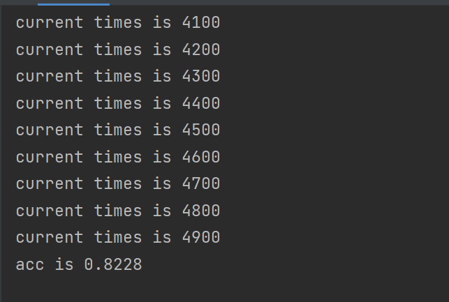

## 代码结构

不能改变的相对路径：

* curr_3.pth
* best.onnx
* main.py
* SIM.py. 

由于代码内相对路径的定义，这四个文件必须在同一层文件夹下。

## API调用

当前代码可以完成的：读取两张掌纹图片，判断这两部分掌纹是否相同。

我将代码打包成了三个部分：

* load the yolo model,这部分就一行调库代码，可以直接获取
* 识别图像ROI：使用getinput函数，传入图片路径和model即可。返回一个可以被cv2.imwrite保存的ROI图像
* 匹配ROI：使用compareROI ，传入两部分ROI进行匹配

具体可以读main中注释理解。使用示例已实现在main函数中

可以修改的部分：Siamese网络中，similarity大于0.7才认为相同，yolo网络中，区域CONFIDENCE大于0.5才认为识别到有效区域

## 环境安装

在当前目录下运行

~~~bash
conda env create -f environment.yml
~~~

即可安装

或者可以根据yml中的文件一个一个安装

## 简要说明

本次掌纹识别作业中，使用同济大学掌纹数据集，使用yolov8s作为掌纹ROI区域识别网络，使用基于mobilenet_v2骨架的Siamese网络作为匹配，将mobilenet_v2最终的分类层做了全连接映射，改为了二分识别识别层。具体train方法在simpletrain和Siamesetrain文件中（数据集由于过大不提供）

Siamese准确率测试如下：

yolov8s训练结果相关信息在train文件夹中